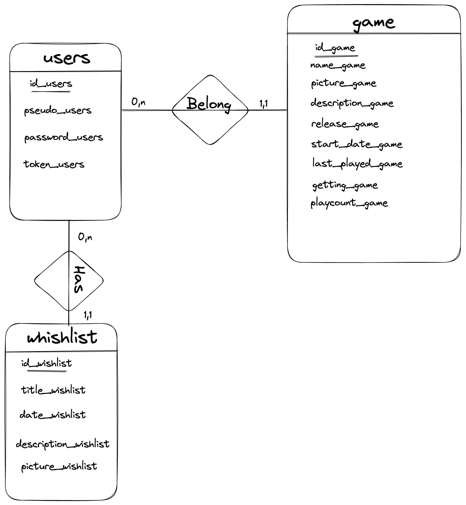
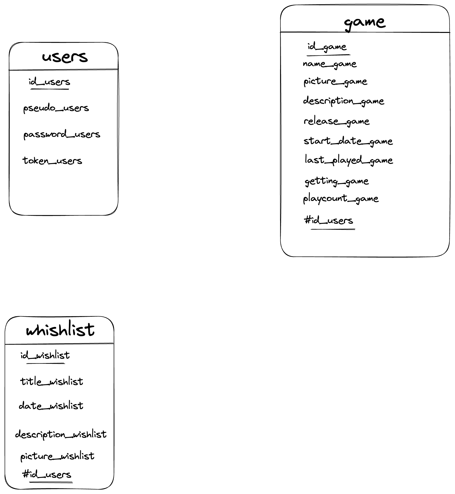
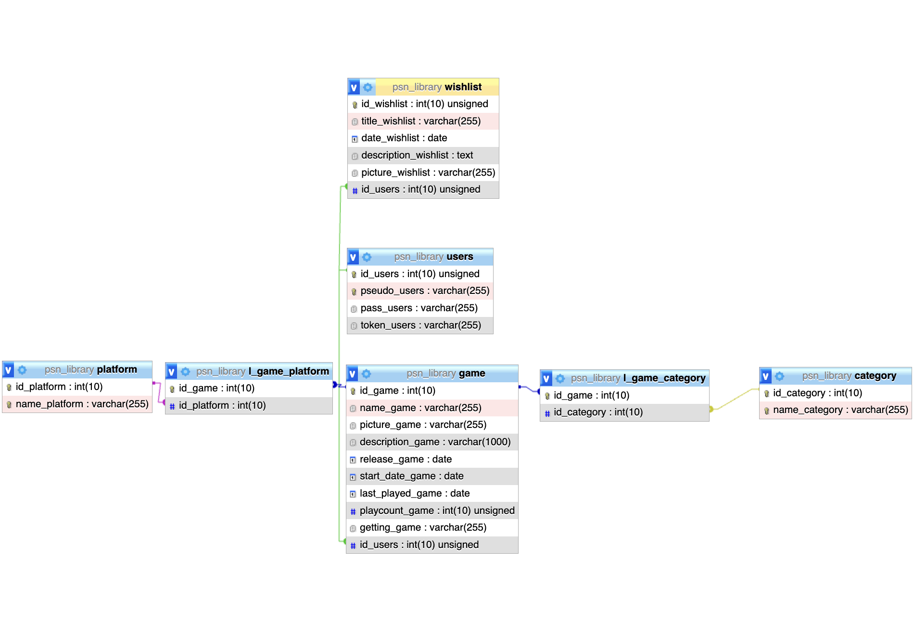

# get_psn_library

:warning: The database schema was modified throughout the project to adapt to what I could use from the API and the implementations I wanted to put in place to make the application useful for other users. New table to implements users (sign up form) and to save their token, new table to store games that do not yet have a release date. Ability to create a  partial CRUD for user's desired games (maybe an update incoming for a total crud)...

## Data Conceptual Model
### Management rules
* A user has an identifier, unique pseudo, a password, and a token
* **A user has at least 0 game and at most several games**
* A game has an identifier, a name, an image, a description, a release date, a started date for games, a last played game, a number of hours played and a way to get it.
* **A user has at least 0 wished game and at most several wished games**
* A wished game has an identifier, a title, a date expected, a description and a picture

### Data dictionary

| **Mnemonic Code**  | **Description**           | **Type** | **Size**   | **Comment**   |
|--------------------|---------------------------|----------|------------|---------------|
| id_game            | Game identifier           | N        | 10         | *Unsigned*    |
| name_game          | Name for a game           | N        | 50         |               |
| picture_game       | Picture for game          | AN       | 50         |               |
| description_game   | game description          | AN       | 1000       |               |
| release_game       | release date for a game   | DATE     |            | *Fr format*   |
| start_date_game    | Start date for a user     | DATE     |            | *Fr format*   |
| last_played_game   | last game played          | DATE     |            | *Fr format*   |
| playcount_game     | numbers of hours played   | N        | 10         |               |
| getting_game       | name for how did you get  | N        | 2          |               |
| id_users           | users identifier          | N        | 10         | *Unsigned*    | 
| pseudo_users       | Name for a user           | AN       | 10         | *Unique*      |
| password_users     | Password to login         | AN       | 50         | *Hashed*      |
| token_users        | Token provided by PSN     | AN       | 50         | *From Sony*   |
| id_wishlist        | identifier                | N        | 10         | *Unsigned*    |
| title_wishlist     | name for a wished game    | AN       | 50         |               |
| date_wishlist      | expected date             | DATE     |            | *Fr format*   |
| description_wishlist| description about game.  | AN.      | 200        |               |
| picture_wishlist   | picture uploaded for a wish| AN      | 50         |               |

### Functional depedencies

* <ins>id_game</ins> ? name_game, picture_game, description_game, release_game, start_date_game, last_played_game, playcount_game, getting_game
* <ins>id_users</ins> ? pseudo_users, password_users, token_users
* <ins>id_wishlist</ins> ? title_wishlist, date_wishlist, description_wishlist, picture_wishlist

### Final DCM

## Logical data model

## Physical data model

:warning: The tables shown in this diagram are not all present. I was unable to retrieve all the informations from the API for now.
Send me a DM if you know how can I get trophy titles, descriptions for a game or a genre.

## PlayStation API

I used a package from packagist.org to retrieve the entire library present on the PSN for each user.
[More informations about this package](https://packagist.org/packages/tustin/psn-php)

- Make sure that you have PHP and Composer installed on your machine. If not, you can install them by following the instructions on the PHP and Composer websites.
- Run the "composer install" command to install all project dependencies.

## Roadmap since the beginning

- I started by loading all the game data sent by the API on the homepage, then, in order to optimize the page display, I put this request in a processing file accessible through a button for the client.

- In order to lighten the home page, I have created different functions that allow me to adapt the displayed content. For a comprehensive list, please refer to the functions.php file.

- I displayed the information specific to each game in the gameInfo file, and in order for the user to be able to return to the previous page and continue their browsing, I used the HTTP_REFERER key in the $_SERVER superglobal.

- I wanted to make my application more useful, so I decided to manage users using the UserLogin class and a Session class. I debated for a long time about whether to create a single class to handle both the session and the login, but their responsibilities were different. The UserLogin class is responsible for verifying user authentication information and redirecting the user to the appropriate page based on the verification result, while the Session class is responsible for managing the user session.

- Users are now able to create a wishlist of games, so I started by implementing the delete part of the CRUD. Then, I refactored everything into a wishlist manager class to handle all CRUD operations for this wishlist. Other operations will be available in a later version.
