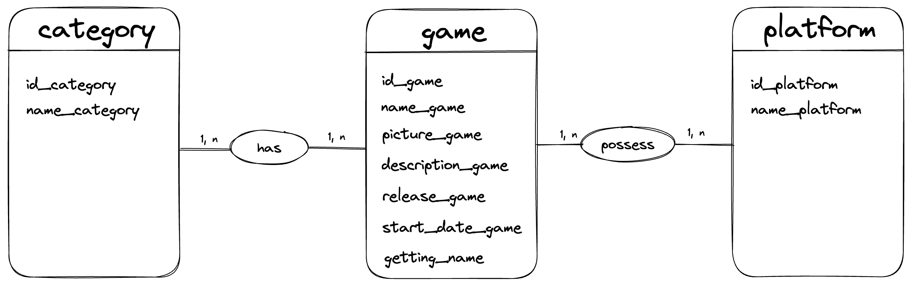
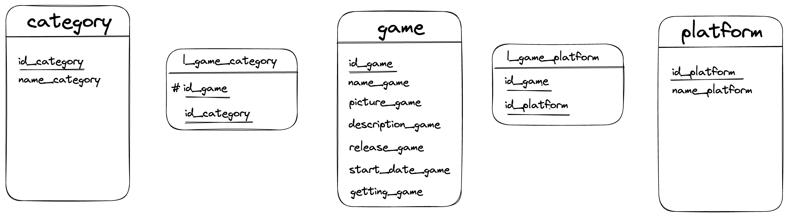
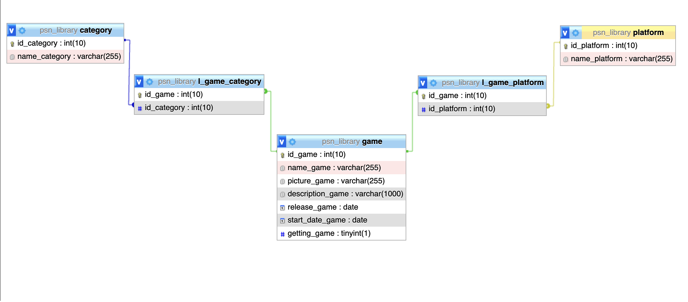

# get_psn_library

## Data Conceptual Model
### Management rules
* A user has an identifier, unique pseudo, a password, and a token
* **A user can have at most one library**
* **A library can have at least 0 games and at most several games**
* A game has an identifier, a name, an image, a description, a release date, a started date for games, a last played game, a number of hours played and a way to get it.
* A user has a wishlist
* **A wishlist has at least O game whished and at most several desired games**
* A game wished has an identifier, a title, a date expected, a description and a picture

### Data dictionary

| **Mnemonic Code**  | **Description**           | **Type** | **Size**   | **Comment**   |
|--------------------|---------------------------|----------|------------|---------------|
| id_game            | Game identifier           | N        | 10         | *Unsigned*    |
| name_game          | Name for a game           | N        | 50         |               |
| picture_game       | Picture for game          | AN       | 50         |               |
| description_game   | game description          | AN       | 1000       |               |
| release_game       | release date for a game   | DATE     |            | *Fr format*   |
| start_date_game    | Start date for a user     | DATE     |            | *Fr format*   |
| last_played_game   | last game played          | DATE     |            | *Fr format*   |
| playcount_game     | numbers of hours played   | N        | 10         |               |
| getting_game       | name for how did you get  | N        | 2          |               |
| id_users           | users identifier          | N        | 10         | *Unsigned*    | 
| pseudo_users       | Name for a user           | AN       | 10         | *Unique*      |
| password_users     | Password to login         | AN       | 50         | *Hashed*      |
| token_users        | Token provided by PSN     | AN       | 50         | *From Sony*   |
| id_wishlist        | identifier                | N        | 10         | *Unsigned*    |

### Functional depedencies

* <ins>id_game</ins> ? name_game, picture_game, description_game, release_game, start_date_game, getting_game
* <ins>id_category</ins> ? name_category
* <ins>id_platform</ins> ? name_platform

### Final DCM

## Logical data model

## Physical data model

